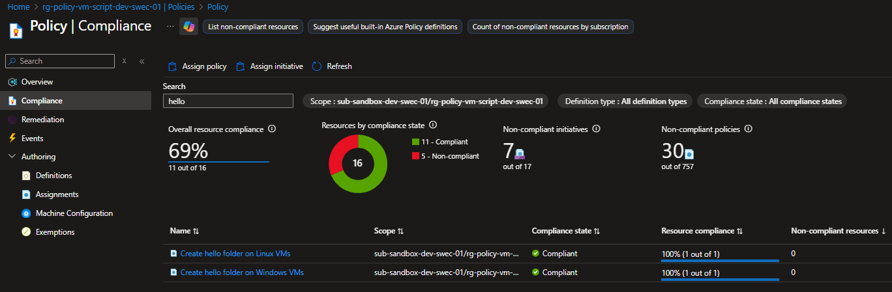

# Azure Policy - Deploy Scripts on VMs

This folder contains Terraform code to deploy Azure Policy definitions and assignments that automatically run PowerShell/Shell scripts on Windows and Linux VMs to create a simple "hello" folder.

## Purpose

This demo showcases how to use Azure Policy with the `DeployIfNotExists` effect to automatically execute scripts on virtual machines using the Run Command extension. The policies:

- **Windows VMs**: Deploys a PowerShell script that creates a `C:\hello` folder
- **Linux VMs**: Deploys a Shell script that creates a `/hello` folder



## What Gets Deployed

- 1 Resource Group
- 1 Virtual Network with a subnet
- 1 Network Security Group
- 1 Windows VM (with public IP)
- 1 Linux VM (with public IP)
- 2 Policy Definitions (Windows and Linux)
- 2 Policy Assignments (scoped to the resource group)

## Prerequisites

- [Terraform](https://www.terraform.io/downloads.html) >= 1.5.0
- [Azure CLI](https://docs.microsoft.com/en-us/cli/azure/install-azure-cli) logged in with appropriate permissions
- An Azure subscription with permissions to create resources and policies

## Usage

### 1. Initialize and Deploy

```bash
# Initialize Terraform
terraform init

# Preview the changes
terraform plan -out=main.tfplan

# Apply the changes
terraform apply main.tfplan
```

### 2. Verify the Policy Effect

After deployment, you can verify that the "hello" folder was created on the VMs using the **Run Command** feature in the Azure Portal or Azure CLI.

#### Windows VM Verification

```powershell
# Using Azure CLI
az vm run-command invoke \
  --resource-group rg-policy-vm-script-dev-swec-01 \
  --name vm-win-demo-01 \
  --command-id RunPowerShellScript \
  --scripts "Get-ChildItem -Path 'C:\' -Force | Where-Object { \$_.Name -eq 'hello' }"
```

#### Linux VM Verification

```bash
# Using Azure CLI
az vm run-command invoke \
  --resource-group rg-policy-vm-script-dev-swec-01 \
  --name vm-linux-demo-01 \
  --command-id RunShellScript \
  --scripts "ls -la / | grep hello"
```

## Important Notes on Policy Timing

⚠️ **Azure Policies with `DeployIfNotExists` effect only apply to newly created or updated resources.** 

If the VMs are created **before** the policy assignment is complete, the policy will not automatically apply to them. You have two options:

### Option 1: Recreate the VMs

Modify the VM names in `terraform.tfvars` to force recreation:

```hcl
vm_name       = "vm-win-demo-02"  # Changed from vm-win-demo-01
linux_vm_name = "vm-linux-demo-02"  # Changed from vm-linux-demo-01
```

Then re-run:

```bash
terraform plan -out=main.tfplan
terraform apply main.tfplan
```

### Option 2: Create a Remediation Task

You can trigger the policy on existing resources by creating a remediation task in the Azure Portal:

1. Go to **Azure Policy** in the portal
2. Navigate to **Remediation**
3. Click **+ Create Remediation Task**
4. Select the appropriate policy assignment
5. Configure the scope and create the task

Or using Azure CLI:

```bash
# For Windows policy
az policy remediation create \
  --name "remediate-windows-hello-folder" \
  --policy-assignment "assign-hello-folder-windows" \
  --resource-group "rg-policy-vm-script-dev-swec-01"

# For Linux policy
az policy remediation create \
  --name "remediate-linux-hello-folder" \
  --policy-assignment "assign-hello-folder-linux" \
  --resource-group "rg-policy-vm-script-dev-swec-01"
```

## Cleanup

To destroy all resources:

```bash
terraform destroy
```

## Files

| File | Description |
|------|-------------|
| `main.tf` | Main Terraform configuration |
| `variables.tf` | Variable definitions |
| `terraform.tfvars` | Variable values |
| `outputs.tf` | Output definitions |
| `policy-definition-windows.json` | Windows policy definition |
| `policy-definition-linux.json` | Linux policy definition |
| `Run-Script.ps1` | Helper script for verification |
| `Verify-Policy.ps1` | PowerShell verification script |
